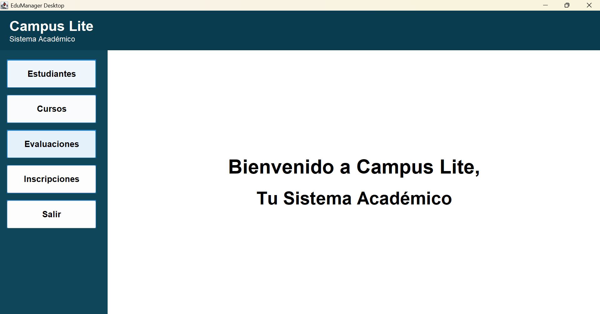
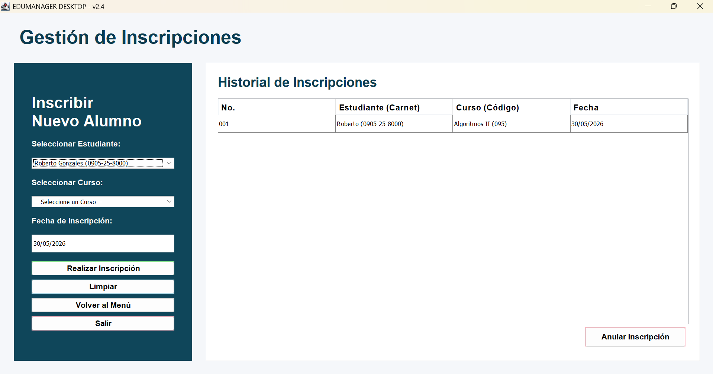

# Proyecto-Campus-Lite

## Integrantes del grupo
* Emilyn Verenice Recinos Salguero
* Osvin Leonel Gamez Medina
* Gabriel Alejandro Garcia Payes

**Opción elegida:** Campus Lite - Opción A

## Versión de JDK utilizada
**Java JDK 11 **Nota Importante:** Todos los miembros del equipo de desarrollo hemos configurado nuestro entorno y utilizamos exactamente la misma versión del JDK para evitar conflictos de compatibilidad durante la compilación y ejecución del proyecto.

## Cómo clonar el repositorio
Para obtener una copia local del proyecto, abre tu terminal (Símbolo del sistema, Git Bash o PowerShell) y ejecuta el siguiente comando:

```bash
git clone [URL_DE_TU_REPOSITORIO_AQUÍ]
Una vez clonado, navega a la carpeta del proyecto:

Bash
cd [NOMBRE_DE_LA_CARPETA_DEL_PROYECTO]


## Cómo ejecutar el proyecto
Opción 1: Desde un IDE (Recomendado - Eclipse, IntelliJ, NetBeans)

Abre tu IDE y selecciona la opción para abrir o importar un proyecto existente.

Selecciona la carpeta que acabas de clonar.

Asegúrate de que el proyecto esté configurado para usar el JDK mencionado anteriormente.

Navega hasta el paquete model (o donde se encuentre tu clase principal).

Haz clic derecho sobre el archivo Main.java y selecciona Run as Java Application.

Opción 2: Desde la Terminal (Línea de comandos)

Navega a la carpeta src del proyecto.

Compila los archivos (asegúrate de que todas las clases estén referenciadas correctamente):

Bash
javac model/Main.java


Ejecuta el programa:

Bash
java model.Main


Decisiones de diseño
El desarrollo de Campus Lite se orientó a crear una aplicación de escritorio robusta, intuitiva y basada estrictamente en el paradigma de Programación Orientada a Objetos (POO). A continuación, se detallan las decisiones arquitectónicas y de diseño tomadas:

Arquitectura y Planificación Visual: Antes de escribir el código, se utilizó Figma/Stich para diseñar los diagramas de arquitectura del sistema. Esto permitió mapear visualmente las relaciones entre las clases principales (Estudiante, Curso, Inscripción) y asegurar la compatibilidad de la lógica antes de programar en Java.

Interfaz Gráfica (GUI): Se utilizó la biblioteca nativa Java Swing para desarrollar todas las ventanas. Se aplicó un diseño limpio y funcional.

Navegación Centralizada: Se implementó una pantalla principal (DashboardView) que actúa como menú central. Desde aquí, los usuarios pueden acceder a los distintos módulos (Estudiantes, Cursos, Evaluaciones, Inscripciones).

Modularidad: Se separaron las vistas en ventanas independientes (StudentsView, CoursesView, etc.). Al navegar, se destruye la ventana anterior (dispose()) y se abre la nueva, compartiendo las listas maestras de datos por medio de los constructores. Esto facilita enormemente el mantenimiento y evita el sobreconsumo de memoria RAM.

Herencia y Polimorfismo: Para gestionar las calificaciones, se diseñó una clase abstracta Evaluation. De ella heredan clases específicas (WrittenExam, Laboratory, Project), cada una sobreescribiendo el método getObtainedScore() para calcular su nota real según sus propias reglas de negocio (por ejemplo, el laboratorio suma puntos base o el proyecto tiene un multiplicador).

Persistencia de Datos (Serialización): Para que la información no se pierda al cerrar el programa, se implementó una clase PersistenceManager. Todas las clases del modelo implementan la interfaz Serializable, lo que permite guardar automáticamente las listas de objetos en un archivo local (campus_lite_data.dat) cada vez que se agrega, edita o elimina un registro.

Simplificación del Flujo: Se decidió eliminar el inicio de sesión (Login) para simplificar la funcionalidad mínima requerida, priorizar el desarrollo de las operaciones CRUD principales y mejorar la estabilidad general del sistema en esta versión Lite.

 Capturas de pantalla 

 **1. Pantalla Principal (Dashboard)**


**2. Pantalla Estudiantes (Estudiantes)**


**3. Pantalla Inscripcion (Inscripcion)**



